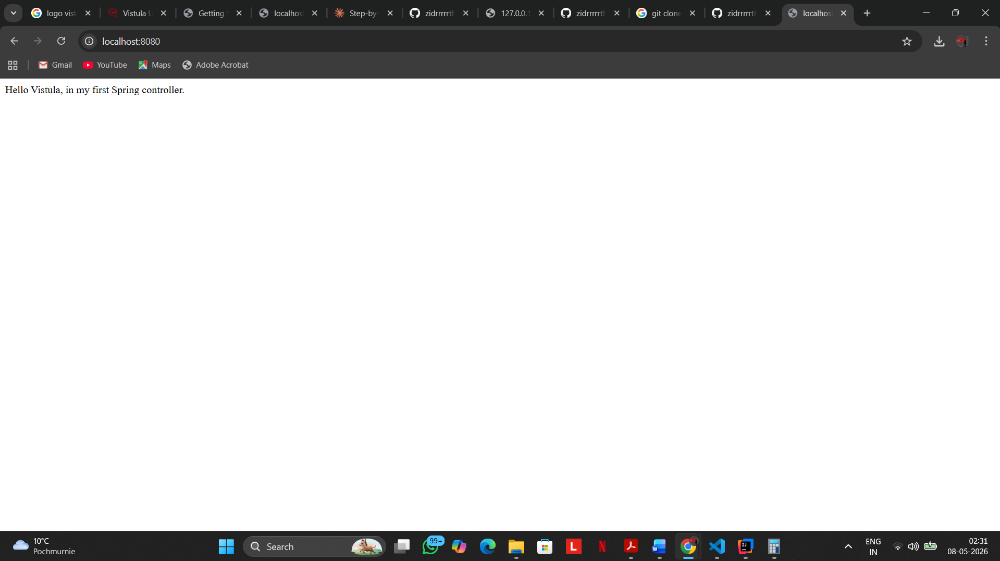
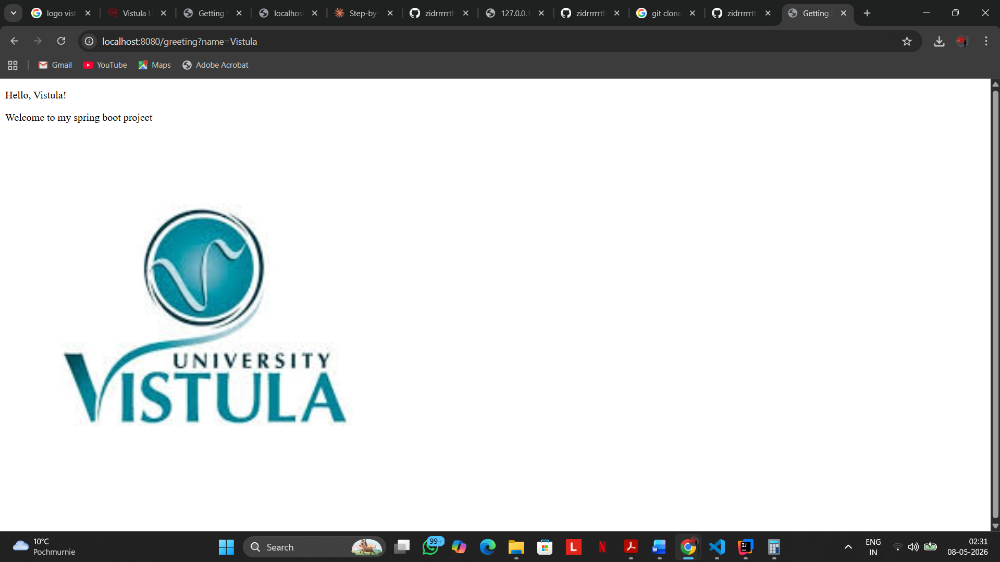

# First Spring Boot MVC Project

## Features
- Returns a plain text greeting at homepage
- Returns a personalized HTML greeting page with image

---

## Dependencies Used

- Lombok
- Spring Web
- Thymeleaf
- Maven

---

## Project Structure

```
MVC_APP/
├── .idea/
├── .mvn/
├── src/
│   ├── main/
│   │   ├── java/
│   │   │   └── pl.edu.vistula.firstprojectjavaspring/
│   │   │       ├── controller/
|   |   |       |   ├── HelloController.java
│   │   │       │   └── pl.edu.vistula.firstprojectjavaspring/
│   │   │       └── FirstProjectJavaSpringApplication.java
│   │   └── resources/
│   │       ├── static/
│   │       │   └── images/
│   │       └── templates/
│   └── test/
└── target/
```
## Controller Code

```
@Controller
public class HelloController {

    @GetMapping(value = "/")
    @ResponseBody
    public String hello() {
        return "Hello Vistula, in my first Spring controller.";
    }

    @GetMapping("/greeting")
    public String greeting(
            @RequestParam(name="name", required=false, defaultValue="World")
            String name, Model model) {
        model.addAttribute("name", name);
        return "greeting";
    }
}
```
_____

## Index Page (/)
- URL: https://localhost:8080/
- Method: hello()
- When (/) is opened, the hello() method runs
- It returns a String

  

  _____

  ## Greeting Page ( /greeting )
- URL: https://localhost:8080/greeting?name=siddharth
- Takes the Name from the URL
- Save it in the model
- Returns "greeting"
- Then Spring looks for templates/greeting.html

  

  ________


